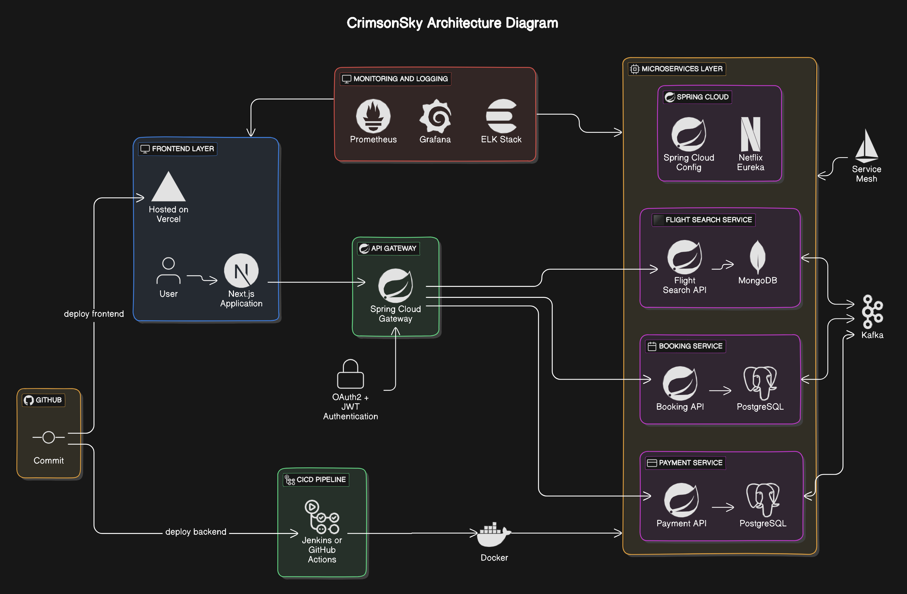

# CrimsonSky - An Flight Booking Microservices Application

# Live Link / Demo Link: 🔗
Access my site at **[localhost:8765](http://localhost:8765)**

# Table of Content: 📑

- [About The App](#about-the-app-)
- [Screenshots](#screenshots-)
- [Technologies](#technologies-%EF%B8%8F--%EF%B8%8F)
- [Setup](#setup-)
  - [Java + Spring Boot](#java--spring-boot)
    - [Available Scripts](#available-scripts--)
- [Approach](#approach-)
- [Status](#status-)
- [License](#license-)

# About the App: 📚
CrimsonSky is a flight booking system built using Spring Boot Microservices and Kafka, hosted on AWS EC2. The system is designed to handle flight search, booking, and payments in a scalable and resilient manner. The architecture follows a microservices pattern with each service decoupled to enhance flexibility and fault-tolerance.

# Screenshots: 📷

# Technologies: ☕️  ⚛️

- Java
- Spring Cloud
- Spring Boot
- Spring Web
- Spring Api Gateway
- Spring Data JPA
- Kafka
- AWS EC2 and Cloudflare
- H2, MongoDB and Postgres DB
- Swagger OpenAPI

# Setup: 💻

## Java + Spring Boot 

### Available Scripts - 

In the project directory, you can run:

### `mvn install`

To install all the dependencies required for the project.

### `mvn spring-boot:run`

Runs the app in the development mode.\
Open [http://localhost:8765](http://localhost:8765) to view it in your browser.

### `npm clean install`

Builds the app for production to the `target` folder.\
It correctly bundles Spring Boot app in production mode and optimizes the build for the best performance.

Your app is ready to be deployed!

# Approach: 🚶
We are using **React** for frontend UI and **Java with Spring Boot** for backend API with **Microservices** architecture.

# Status: 📶
Work in Progress...🛠️

# License: ©️
MIT License (**[Check Here](LICENSE)**)