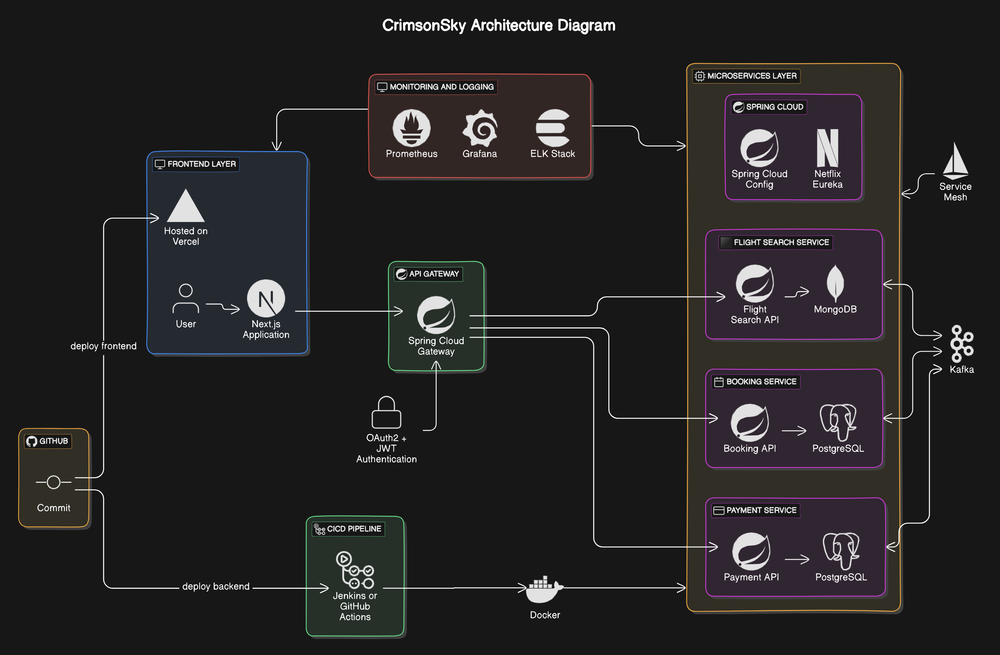

# CrimsonSky - Flight Booking System
## Technical Design Document :

## **Introduction**
- **Purpose**:
The purpose of this document is to outline the technical design and architecture of the **CrimsonSky** flight booking system, which is based on a microservices architecture using **Spring Boot** and **Kafka**. The system will be hosted on **AWS EC2** with containerized services for scalability and fault tolerance.
- **Scope**:
This document covers the high-level architecture, component designs, messaging patterns, databases, and non-functional requirements of the **CrimsonSky** flight booking system.
- **Definitions**:
    - **EC2**: Amazon Elastic Compute Cloud
    - **Eureka**: Netflix service discovery mechanism
    - **Kafka**: Event-driven message broker
    - **Spring Cloud Config**: Centralized configuration management
---

## **System Architecture**
- **High-Level Overview**: 
  **CrimsonSky** is a microservices-based flight booking system consisting of multiple independent services (Flight Search, Booking, Payment) that communicate via **Kafka**. The system uses **Spring Cloud Gateway** as the API Gateway for routing and security, with **Netflix Eureka** for service discovery. Databases include **PostgreSQL** and **MongoDB**, and the system is deployed on **AWS EC2** instances.

- **Key Components**:
    - **Frontend Layer**: Next.js application hosted on EC2 instances.
    - **API Gateway**: Spring Cloud Gateway for routing and security.
    - **Microservices Layer**: Flight Search, Booking, and Payment services.
    - **Messaging Layer**: Kafka for event-driven communication.
    - **Service Discovery**: Netflix Eureka for service registration and discovery.
    - **Databases**: PostgreSQL and MongoDB for transactional and non-transactional data.
    - **Monitoring and Logging**: Prometheus, Grafana, ELK Stack for monitoring and logging.
    - **Configuration Management**: Spring Cloud Config for centralized configuration.
    - **CI/CD Pipeline**: Jenkins or GitHub Actions for automating build and deployment.
    - **Security**: OAuth2, JWT, Spring Security for secure API access.

- **Architecture Diagram**:

  
---

## **Component Design**

### **Frontend Layer**
- **Next.js Application**: 
    - **Hosting**: Hosted on EC2 instances, with static assets served through **S3**.
    - **Communication**: Frontend communicates with backend services through **Spring Cloud Gateway**.
  
### **API Gateway**
- **Spring Cloud Gateway**: 
    - **Responsibilities**: Routes requests to the appropriate microservices, handles security (OAuth2, JWT), and rate limiting.
    - **Deployment**: Deployed on EC2 as a Dockerized microservice.
  
### **Microservices Layer**

#### **Flight Search Service**
- **Database**: **MongoDB** (Flexible schema for dynamic flight data).
- **Responsibilities**: Handles flight search queries, flight availability, and fetching real-time flight data.
- **Deployment**: Deployed on AWS EC2 using Docker containers.

#### **Booking Service**
- **Database**: **PostgreSQL** (Transactional data, booking information).
- **Responsibilities**: Manages flight bookings, seat allocation, and customer data.
- **Deployment**: Deployed on AWS EC2 as a microservice in Docker.

#### **Payment Service**
- **Database**: **PostgreSQL** (Transactional data for payment records).
- **Responsibilities**: Manages flight payments, handles payment gateway integrations, and maintains transaction logs.
- **Deployment**: Deployed on EC2 using Docker containers.

### **Messaging and Event-Driven Architecture**
- **Kafka**: 
    - **Deployment**: Hosted on EC2 instances, used for inter-service communication (e.g., publishing booking events for payment service).
  
### **Service Discovery**
- **Netflix Eureka**: 
    - **Deployment**: EC2 instances running Eureka for service registration and discovery.
  
### **Databases**

- **MongoDB**: 
    - **Use Case**: Flight availability and search data.
    - **Deployment**: Hosted on EC2 instances with containers.
  
- **PostgreSQL**: 
    - **Use Case**: Booking and Payment Services.
    - **Deployment**: Deployed on EC2 instances with Docker containers.
  
### **Load Balancing and Auto Scaling**
- **Elastic Load Balancer (ELB)**: Routes external traffic to EC2 instances, ensuring high availability.
- **Auto Scaling Groups (ASG)**: Dynamically scales EC2 instances based on traffic patterns and CPU usage.

### **Monitoring and Logging**

- **Prometheus and Grafana**: 
    - **Deployment**: Hosted on EC2 instances to monitor metrics and provide dashboards for system health.
  
- **ELK Stack (Elasticsearch, Logstash, Kibana)**: 
    - **Deployment**: Centralized logging hosted on EC2, used for error tracking and performance monitoring.
  
### **Caching**
- **Redux**: Used on the frontend for state management and caching of frequently accessed data (e.g., flight search results).

### **Configuration Management**
- **Spring Cloud Config**: 
    - **Deployment**: Centralized configuration management deployed as a microservice on EC2, ensuring consistency across environments.
  
### **CI/CD Pipeline**
- **Jenkins or GitHub Actions**: 
    - Used for automating the build, testing, and deployment process of microservices on EC2 instances.
  
### **Security**
- **OAuth2 + JWT Authentication**: 
    - Manages authentication and authorization across microservices using **JWT** tokens.

---
## **Non-Functional Requirements**

- **Performance**: 
    - The system will use **auto-scaling** and **load balancing** to handle variable loads, ensuring minimal downtime.
    - **Kafka** will enable asynchronous processing to reduce response times for flight search and bookings.

- **Security**:
    - **OAuth2** and **JWT** along with **Spring Security** for secure API access.
    - Rate limiting at the **Spring Cloud Gateway** layer to protect against abuse.
---
## **Appendices**
- **Glossary**: 
    - **OAuth2**: Open Authorization Framework.
    - **JWT**: JSON Web Token.
- **References**: 
    - Spring Cloud documentation.
    - AWS EC2 best practices.
- **Additional Diagrams**: 
    - Will add additional diagrams to illustrate detailed service interactions.